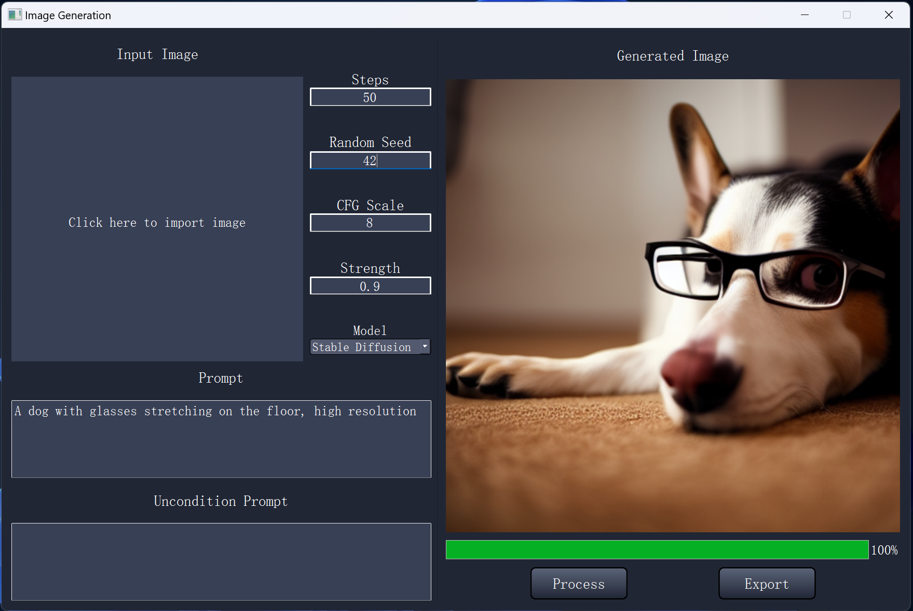

# Image Generation with Stable Diffusion


This project aims to build stable diffusion image generation model from scratch. And load the pre-trained weights from hugging face.



### Build: 

	CPU: Intel i9-13900H (14 cores)
	GPU: NVIDIA RTX 4060 (VRAM 8 GB)
	RAM: 32 GB


### Python Packages:

	conda install pytorch==2.1.2 torchvision==0.16.2 torchaudio==2.1.2 pytorch-cuda=12.1 -c pytorch -c nvidia
	conda install -c conda-forge tqdm = 4.64.1
	conda install -c conda-forge matplotlib = 3.8.0
	conda install -c conda-forge numpy = 1.26.4


### Code Structure:
```bash
├── GUI.py (Run to generate a GUI)
├── main.py
├── attention.py
├── clip.py
├── ddpm.py
├── diffusion.py
├── vae.py
├── model_converter.py
├── pipleline.py
├── qt_main.ui

```

### Credits:
	https://www.youtube.com/watch?v=ZBKpAp_6TGI&ab_channel=UmarJamil
	"High-Resolution Image Synthesis with Latent Diffusion Models"
	